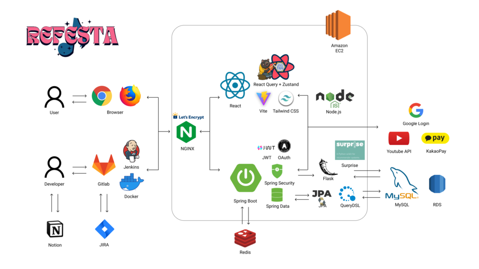

# 🎆Refesta


Refesta : 사용자 맞춤 페스티벌을 추천·예매하고, 그 날의 기억을 음악과 함께 추억할 수 있는 플랫폼

> https://j10a601.p.ssafy.io/login

## 📅 진행 기간

2024.02.26 ~ 2024.04.04

## 🤝 팀원 소개

SSAFY 10기 특화 프로젝트 A601

|                      팀장<br>권정훈                      |                   팀원<br>강지헌                   |                      팀원<br>이경배                       |                  팀원<br>이지원                  |                         팀원<br>최정윤                          |                     팀원<br>하재률                      |
| :------------------------------------------------------: | :------------------------------------------------: | :-------------------------------------------------------: | :----------------------------------------------: | :-------------------------------------------------------------: | :-----------------------------------------------------: |
| FE <br> 검색, <br> 페스티벌, <br> 셋리스트 <br> 플레이어 | BE/Infra <br> 추천 알고리즘, <br> 추천 서버, CI/CD | BE <br> 검색, <br> 자동완성, <br> 페스티벌, <br> 아티스트 | FE <br> 로그인, <br> 회원정보, <br> 홈, 자동완성 | BE <br> 로그인, <br> 회원정보, <br> 예매, 후기, <br> 마이페이지 | FE <br> 예매/결제, <br> 아티스트, 후기, <br> 마이페이지 |

## 🌍 프로젝트 소개

`"지난 여름에 갔던 페스티벌 너무 재밌었는데..!"`

갈수록 페스티벌을 찾는 뜨거운 청춘들이 많아지는 지금, 흩어진 페스티벌 정보를 한 번에 확인할 수는 없을까요? 지난 여름에 갔던 페스티벌을 손쉽게 추억할 수 없을까요?

Refesta을 통해 맞춤 페스티벌 추천을 받고, 예매하고, 추억해보세요 !

## 🎶 주요 기능

### 맞춤 페스티벌 정보 제공


- 유튜브 재생 목록 또는 선택한 선호 장르 기반 추천 시스템을 통해 사용자 맞춤 추천
- 예정된 페스티벌의 상세 정보 / 좋아할만한 아티스트 / 지난 페스티벌의 셋리스트 제공
- 노래 재생 및 검색, 좋아요 기반 CBF 알고리즘을 통해 매일 새벽 추천 업데이트

### 예매


- 예정된 페스티벌에 대한 예매
- 카카오페이 결제
- 마이페이지를 통한 예매 내역 확인

### 검색


- 페스티벌, 아티스트 통합 검색
- 자동 완성을 통한 손쉬운 검색

### 셋리스트


- 지난 페스티벌을 그대로 본딴 노래 목록 및 플레이어 제공
- 전체 또는 원하는 아티스트를 선택하여 재생 목록 커스텀 가능
- 노래 감상과 함께 후기 게시판을 통한 페스티벌 추억을 회상


- 마음에 드는 재생 목록이라면, 연동된 나의 유튜브 재생 목록으로 내보내기

## 🏛️ 프로젝트 구조도



## 💻 주요 기술

[](https://ko.legacy.reactjs.org/)
[](https://spring.io/projects/spring-boot)
[](https://www.oracle.com/java/)
[](https://mysql.com/)
[](https://redis.io/)

[](https://tanstack.com/query/v4/docs/framework/react/overview)
[](https://tailwindcss.com/)
[](https://developers.kakao.com/product/kakaoPay)

[](https://git-scm.com/)
[](https://about.gitlab.com/)
[](https://www.notion.so/)
[](https://www.atlassian.com/software/jira)
[](https://mattermost.com/)

[](https://www.jetbrains.com/idea/)
[](https://developer.android.com/studio)
[](https://code.visualstudio.com/)

[](https://aws.amazon.com/ec2/)
[](https://www.docker.com/)
[](https://aws.amazon.com/s3/)
[](https://ubuntu.com/)

### Backend - 메인

- Spring Boot 3.2.3
- Spring Data JPA
- Spring Security
- Spring Web
- Spring Cloud AWS
- MySQL
- QueryDSL
- Redis
- Jwt
- AWS S3

### Backend - 추천

- Flask
- PySpark
- MySQL
- schedular
- sklearn

### Frontend

- React
- Vite
- Tailwind
- Zustand
- React Query
- axios
- React Router DOM
- Sweetalert2
- React player
- Browser image compression
- eslint
- prettier

### 배포

- AWS Lightsail
- AWS S3
- AWS RDS
- Nginx
- Jenkins
- Docker

## 📁 프로젝트 파일 구조

### Backend - 메인

```
server

├─java
│ └─com
│ └─a601
│ └─refesta
│ │  
│ ├─artist
│ │ ├─controller
│ │ ├─data
│ │ ├─domain
│ │ │ └─join
│ │ ├─repository
│ │ └─service
│ │  
│ ├─common
│ │ ├─config
│ │ │ AppConfig.java
│ │ │ AWSS3Config.java
│ │ │ QueryDSLConfig.java
│ │ │ RedisConfig.java
│ │ │ RestConfig.java
│ │ │ SecurityConfig.java
│ │ │ WebConfig.java
│ │ │  
│ │ ├─entity
│ │ ├─exception
│ │ ├─jwt
│ │ ├─response
│ │ └─util
│ │  
│ ├─festival
│ │ ├─controller
│ │ ├─data
│ │ ├─domain
│ │ │ └─join
│ │ ├─repository
│ │ └─service
│ │  
│ ├─genre
│ │ ├─domain
│ │ └─repository
│ │  
│ ├─login
│ │ ├─controller
│ │ ├─data
│ │ ├─repository
│ │ └─service
│ │  
│ ├─member
│ │ ├─controller
│ │ ├─data
│ │ ├─domain
│ │ │ └─join
│ │ ├─repository
│ │ └─service
│ │  
│ ├─recommendation
│ │ ├─controller
│ │ ├─data
│ │ ├─domain
│ │ ├─repository
│ │ └─service
│ │  
│ ├─reservation
│ │ ├─controller
│ │ ├─data
│ │ ├─domain
│ │ ├─repository
│ │ └─service
│ │  
│ ├─review
│ │ ├─controller
│ │ ├─domain
│ │ ├─repository
│ │ └─service
│ │  
│ ├─search
│ │ ├─controller
│ │ ├─data
│ │ └─service
│ └─song
│ ├─domain
│ └─repository
│  
└─resources
```

### Backend - 추천

```
recommend
  ├─data
  ├─db
  └─service
```

### Frontend

```
client

│ App.css
│ App.jsx
│ index.css
│ main.jsx
│  
├─assets
│ ├─about
│ ├─carousel
│ └─genre
│  
├─components
│ ├─artistDetail
│ ├─common
│ ├─festivalDetail
│ ├─home
│ │ └─loading
│ │  
│ ├─mypage
│ ├─reservation
│ ├─search
│ └─start
│  
├─hooks
├─layout
├─pages
├─queries
├─store
└─util
```

## 📃 프로젝트 산출물

- [프로젝트 노션](https://instinctive-talk-7a7.notion.site/Aticket-637a6f1875244119a8c89f14ed540b44?pvs=4)
- [화면 정의서](https://www.figma.com/file/bxs6l1zCnb9wPEKiLhj30e/%ED%8E%98%EC%8A%A4%ED%8B%B0%EB%B2%8C-%ED%94%84%EB%A1%9C%EC%A0%9D%ED%8A%B8?type=design&node-id=0-1&mode=design&t=oEZFw1x6hpYl0e2k-0)
- [API 명세서](https://www.notion.so/API-75a33ec196d343899287e49c6e081bdd)

## 📊 ERD 다이어그램


<!-- 결산 페이지 만들면 넣기 
### 프로젝트 결산 노션 페이지
- [4주차 결산 페이지](https://instinctive-talk-7a7.notion.site/8a1c64ca57fd45ff837a4aef4ae53faf?pvs=4) -->
